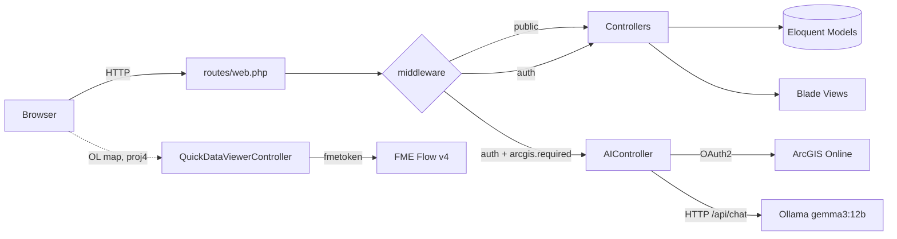

# QuickManage

A Laravel 12 web application for managing FME-backed GIS "apps", external ("custom") apps, HTML page templates, a public app gallery, a geospatial file viewer ([QuickDataViewer](docs/modules/quickdataviewer.md)), and an AI-powered natural-language-to-SQL WHERE-clause tool for ArcGIS feature layers.

- **Framework**: Laravel 12 (PHP 8.2+)
- **Auth scaffolding**: `laravel/ui`
- **Frontend build**: Laravel Mix (webpack) — see [docs/frontend.md](docs/frontend.md)
- **UI**: Bootstrap 5.2, jQuery, Font Awesome, ArcGIS JS API 4.28 (CDN-loaded in [resources/views/layouts/app.blade.php](resources/views/layouts/app.blade.php))
- **Map**: OpenLayers + proj4 (EPSG:28992 / Dutch RD)

---

## Architecture at a glance



See [docs/architecture.md](docs/architecture.md) for the full write-up.

---

## Requirements

- PHP **8.2+** with extensions: `pdo`, `mbstring`, `openssl`, `curl`, `zip`, `fileinfo`, `bcmath`
- Composer 2.x
- Node.js **18+** and npm
- A relational database (MySQL/MariaDB or PostgreSQL; SQLite works for local dev)
- For the AI module: a local [Ollama](https://ollama.com) server on `127.0.0.1:11434` with the `gemma3:12b` model pulled
- For GDB/DWG conversion: reachable FME Flow instance (`FME_SERVER_URL`, `FME_DWG_SERVER_URL`) and token
- For the AI module OAuth: ArcGIS Online app credentials (`ARCGIS_*`)

---

## Install & run

```powershell
git clone <repo> QuickManage
cd QuickManage
composer install
npm install
copy .env.example .env
php artisan key:generate
# Configure DB + integration env vars (see below), then:
php artisan migrate
npm run dev          # build assets (or: npm run watch)
php artisan serve    # http://127.0.0.1:8000
```

> Note: `php artisan migrate` will only create the Laravel stock tables (`users`, `sessions`, `cache`, `jobs`, …). The feature tables (`apps`, `custom_apps`, `app_categories`, `app_galleries`, `folders`, `templates`) have no committed migrations — see [docs/data-model.md](docs/data-model.md) and [docs/known-issues.md](docs/known-issues.md).

### npm scripts

| Script | Purpose |
|---|---|
| `npm run dev` | One-off dev build via Laravel Mix |
| `npm run watch` | Rebuild on change + BrowserSync proxy of `http://127.0.0.1:8000` |
| `npm run hot` | HMR-style watch |
| `npm run prod` | Production build (minified) |

> `vite.config.js` exists but is **not** used by the npm scripts. The active build tool is Laravel Mix (`webpack.mix.js`). Details: [docs/frontend.md](docs/frontend.md).

### Tests

```powershell
php artisan test
```

---

## Environment variables

Standard Laravel keys (`APP_KEY`, `DB_*`, `MAIL_*`, `SESSION_*`) plus the following integration keys consumed by [config/services.php](config/services.php):

| Variable | Used by | Notes |
|---|---|---|
| `ARCGIS_PORTAL` | OAuth redirect, [AIController](app/Http/Controllers/AIController.php) | Default `https://gkb.maps.arcgis.com/...` |
| `ARCGIS_CLIENT_ID` | OAuth | ArcGIS Online app client id |
| `ARCGIS_CLIENT_SECRET` | OAuth token exchange | |
| `ARCGIS_REDIRECT_URI` | OAuth | Must match the registered redirect (e.g. `http://127.0.0.1:8000/oauth-callback`) |
| `FME_SERVER_URL` | [QuickDataViewerController@convertGdb](app/Http/Controllers/QuickDataViewerController.php) | FME Flow v4 workspace URL for GDB→GPKG |
| `FME_DWG_SERVER_URL` | [QuickDataViewerController@convertDwg](app/Http/Controllers/QuickDataViewerController.php) | DWG→GPKG workspace URL |
| `FME_SERVER_TOKEN` | both QDV endpoints | `fmetoken` for FME auth |

See [docs/integrations.md](docs/integrations.md) for details.

---

## Feature map

| Feature | Controller | Client code | Docs |
|---|---|---|---|
| FME-backed Apps | [AppsController](app/Http/Controllers/AppsController.php) | [public/js/CreateHTMLPage_Form.js](public/js/CreateHTMLPage_Form.js), [displayHTMLpage.js](public/js/displayHTMLpage.js) | [modules/apps.md](docs/modules/apps.md) |
| Custom (external URL) apps | [CustomAppsController](app/Http/Controllers/CustomAppsController.php) | [public/js/custom_app/create.js](public/js/custom_app/create.js) | [modules/custom-apps.md](docs/modules/custom-apps.md) |
| App Gallery (public + admin) | [AppGalleryController](app/Http/Controllers/AppGalleryController.php) | [public/js/app_gallery/](public/js/app_gallery/) | [modules/app-gallery.md](docs/modules/app-gallery.md) |
| Folders | [FoldersController](app/Http/Controllers/FoldersController.php) | — | [modules/folders.md](docs/modules/folders.md) |
| HTML page Templates | [TemplatesController](app/Http/Controllers/TemplatesController.php) | — | [modules/templates.md](docs/modules/templates.md) |
| QuickDataViewer (geo files) | [QuickDataViewerController](app/Http/Controllers/QuickDataViewerController.php) | [public/js/quickdataviewer/](public/js/quickdataviewer/) | [modules/quickdataviewer.md](docs/modules/quickdataviewer.md) |
| AI NL→WHERE (ArcGIS) | [AIController](app/Http/Controllers/AIController.php) | [public/js/testAI.js](public/js/testAI.js) | [modules/ai.md](docs/modules/ai.md) |
| Auth | [app/Http/Controllers/Auth/](app/Http/Controllers/Auth) | — | [modules/auth.md](docs/modules/auth.md) |

---

## Documentation index

- [docs/architecture.md](docs/architecture.md) — request lifecycle, layering, session state, exception handling
- [docs/routes.md](docs/routes.md) — full route table by middleware group
- [docs/data-model.md](docs/data-model.md) — models, fields, relationships, migration gaps
- [docs/frontend.md](docs/frontend.md) — build pipeline, SCSS→CSS mapping, layouts, view structure
- [docs/integrations.md](docs/integrations.md) — ArcGIS, Ollama, FME Flow, Mail
- [docs/conventions.md](docs/conventions.md) — code patterns in use across the app
- [docs/known-issues.md](docs/known-issues.md) — security flags, dead code, missing migrations
- `docs/modules/` — per-feature reference
