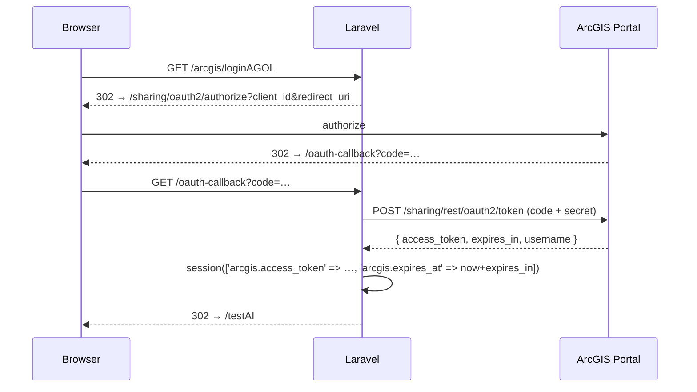
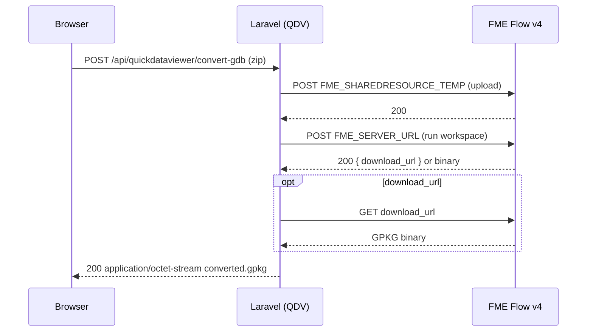

# Integrations

Per-integration summary. Env var config lives in [config/services.php](../config/services.php).

## ArcGIS Online — OAuth 2.0 + REST

- **OAuth flow**: authorization-code, initiated by inline closure at `GET /arcgis/loginAGOL` in [routes/web.php](../routes/web.php); callback at `GET /oauth-callback` → [AIController@callback](../app/Http/Controllers/AIController.php). Token + expiry are written to the **session** (keys `arcgis.access_token`, `arcgis.expires_in`, `arcgis.expires_at`, `arcgis.username`) — not DB.
- **Guard**: [RequireArcgisLogin](../app/Http/Middleware/RequireArcgisLogin.php) (alias `arcgis.required`) redirects to `route('arcgis.loginAGOL')` when missing/expired.
- **Logout**: [LogoutAGOLController@logout](../app/Http/Controllers/Auth/LogoutAGOLController.php) clears ArcGIS session keys and invalidates the Laravel session.
- **Feature layer REST**: [AIController@index](../app/Http/Controllers/AIController.php) queries `GKB_DL_Bomen` FeatureServer with `outStatistics` (group-by `projectcode`); [AIController::getLayerFields](../app/Http/Controllers/AIController.php) reads field names via `?f=json&token=`.
- **Env**: `ARCGIS_PORTAL`, `ARCGIS_CLIENT_ID`, `ARCGIS_CLIENT_SECRET`, `ARCGIS_REDIRECT_URI`.
- ⚠️ TLS verification is disabled outside production (`app()->isProduction()` check in the controller).

### OAuth sequence

## Ollama — local LLM (NL → SQL WHERE)

- **Endpoint**: `http://127.0.0.1:11434/api/chat`, model `gemma3:12b`, `temperature: 0.1`.
- **Two controller actions** in [AIController](../app/Http/Controllers/AIController.php):
  - `nl2where` — one-shot JSON response, enforces a strict `{where, explanation}` schema; WHERE is re-validated by [AIController::sanitizeWhere](../app/Http/Controllers/AIController.php) (rejects `;`, `--`, `DROP/DELETE/...`, and any identifier not in the allow-list returned by `getLayerFields`).
  - `nl2whereStream` — Server-Sent Events. Uses raw `curl` + `CURLOPT_WRITEFUNCTION` to stream model tokens as `text/event-stream` chunks; consumed by [public/js/testAI.js](../public/js/testAI.js) via `EventSource`.
- **Rate limit**: `throttle:10,1` (10 req/min per user).
- No env vars — endpoint is hard-coded to loopback; a developer must run Ollama locally.

## FME Flow (v4) — GDB / DWG conversion

- **Endpoint base**: `https://fme-gkb.fmecloud.com/fmeapiv4/` (hard-coded host; workspace URLs in env).
- **Flow** ([QuickDataViewerController](../app/Http/Controllers/QuickDataViewerController.php)):
  1. Upload input file to `FME_SHAREDRESOURCE_TEMP`.
  2. POST the workspace run (GDB→GPKG via `FME_SERVER_URL`, DWG→GPKG via `FME_DWG_SERVER_URL`).
  3. Response may be either a JSON envelope with a `download_url` or a direct binary — both handled.
  4. Stream back as `application/octet-stream`, filename `converted.gpkg`.
- **Auth header**: `Authorization: fmetoken token=<FME_SERVER_TOKEN>`.
- **Env**: `FME_SERVER_URL`, `FME_DWG_SERVER_URL`, `FME_SERVER_TOKEN`.
- **Limits**: upload ≤ 500 MB, HTTP timeout 300 s, `withoutVerifying()` (TLS off).
- ⚠️ See [known-issues.md](known-issues.md) — [public/js/displayHTMLpage.js](../public/js/displayHTMLpage.js) and [public/js/testAI.js](../public/js/testAI.js) currently contain a **hard-coded** `fmetoken` in client-side JS. The server-side proxy in QuickDataViewer does **not** share this problem.

### GDB conversion sequence

## Mail

- Driver configured via `config/mail.php` + standard `MAIL_*` env. `services.php` has prebuilt keys for Postmark, Resend, SES, Slack — none wired up by code.
- **Custom mailable**: [PasswordResetMail](../app/Mail/PasswordResetMail.php), dispatched from [User::sendPasswordResetNotification](../app/Models/User.php). Renders [resources/views/auth/passwords/mail-templates/reset-password-mail.blade.php](../resources/views/auth/passwords/mail-templates/reset-password-mail.blade.php).

## Hashids

`brick/math` + `hashids` are installed (via vendor) and `use Hashids\Hashids;` is imported at the top of [AppsController](../app/Http/Controllers/AppsController.php), but **the active code uses `Str::uuid()` for `hash_id` / `uniqid`** — the Hashids import is dormant.
